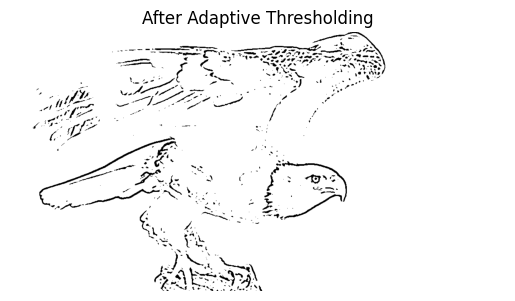
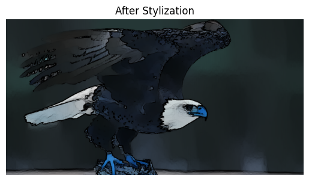
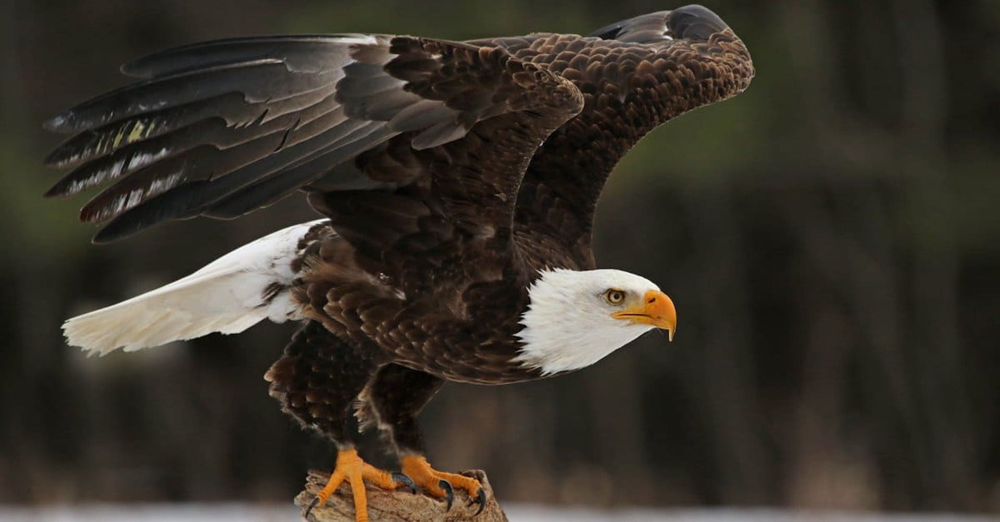
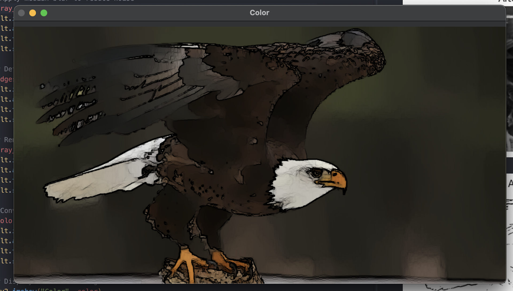
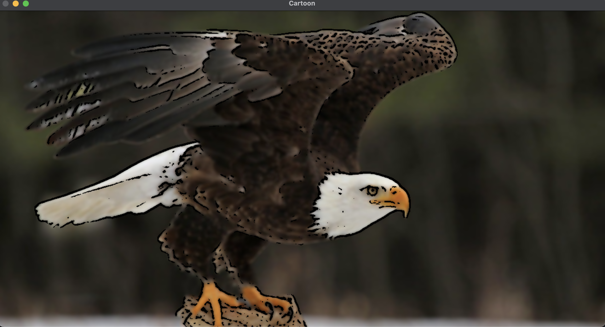

# Scribble_Art

- This is the OpenCv implementation space.

## Description

- This is a small application that allows you to convert the given input image(s) 
to a cartoonized form of look. Here, i used the following methods :

     - Median Blurring, 
     - Adaptive Threshholding, 
     - Bilateral Blurring, 
     - Stylization

Please refer to image results to learn more about it

## Results

### Converted Images

 

 

### Final Result Image

- Final result image result comparison with the original image.

|   Original Image    |               Result Image                |
| :-----------------: | :---------------------------------------: |
|  |  |

### Final Result Comparison

- This is the final result image comparison with ChatGPT generated code example:

|            Final Result Image             |          Result Image by ChatGPT           |
| :---------------------------------------: | :----------------------------------------: |
|  |  |
